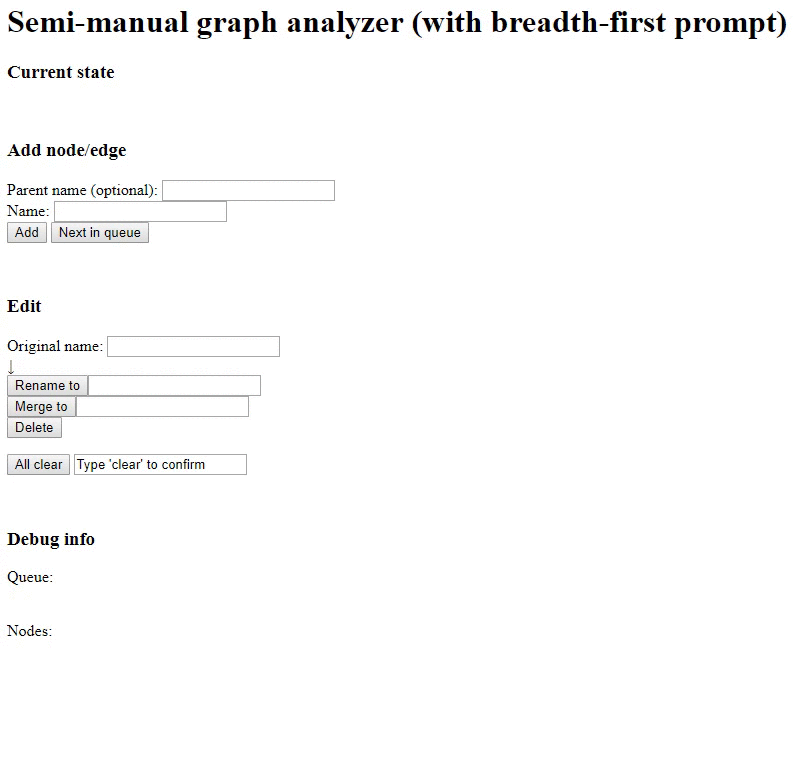

<kbd></kbd>

# Semi-manual graph analyzer
This CGI script analyzes any graph by breadth-first order.

### The CGI script does
* Memorize already visited nodes
* Suggest next step with breadth-first order
* Visualize the structure
* Help us rename/delete/merge nodes

### We need to
* Parse target programs and input dependencies

### Objective
* Universal applicability by using human as a parser
* Help us organizing search and code analysis

# Usage
```
sh start.sh
# Access localhost:8000/cgi-bin/server.py
```

# Dependency
* Python3.6
* graphviz

# Hint
My best alternative (automatic) choices for analyzing properly working programs:
* For Python, use `cProfile` and `gprof2dot` (program must be properly executed)
* For Fortran/C, use `-pg` option of `GCC`, `egypt`, and `graphviz` (program must be properly compiled)
